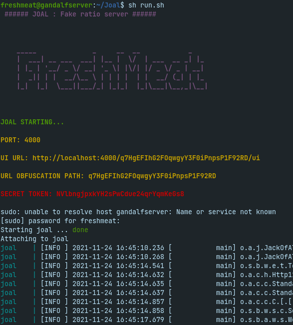

# Joal
Joal with docker compose for Linux system

## What is Joal?
Joal is an open source command line RatioMaster with an optional WebUI.
It is use to create to seeding torrents.
It can be use for save ratio on torrent website like yggtorrent and others.

Created and supported by https://github.com/anthonyraymond
This repo is just a easy way to run Joal

## Dependencies
You need docker and docker-compose to run Joal.
To install dependencies, run : 
`sudo apt-get update && sudo apt-get install docker && sudo apt-get install docker-compose`

## Configuration
Before running Joal, you need to configure it.
Open the ".env" file and change setting like you want

- PATH_TO_CONF=.
- PORT=80
- SECRET_OBFUSCATION_PATH=VERY_SECURE_PATH
- SECRET_TOKEN=VERY_SECURE_PASSWORD

NB : Leave PATH_TO_CONF by default '.', Change only is you change the location of 'config.json'.
PORT is the server's port

## Lauch Joal
- `git clone https://github.com/Freshm4at/Joal/`
- `cd Joal`
- `sudo sh run.sh`

only lauch Joal with run.sh

### Adding torrents
2 ways : 
- add torrents in the torrent's older
- Drap and drop torrents on the web interface

### Screenshot

### Web interface (UI web)
If you want a UI web administration of Joal, you can acess to it with the url :
http://localhost:PORT/SECRET_OBFUSCATION_PATH/ui

after, you need to enter your config setting:
- click on "change connection setting"
- enter your SECRET_OBFUSCATION_PATH and your SECRET_TOKEN

### Seeding speed
you can change it in the config.json file or in the web UI

## Stop Joal
To stop Joal, just ^C on your terminal.

